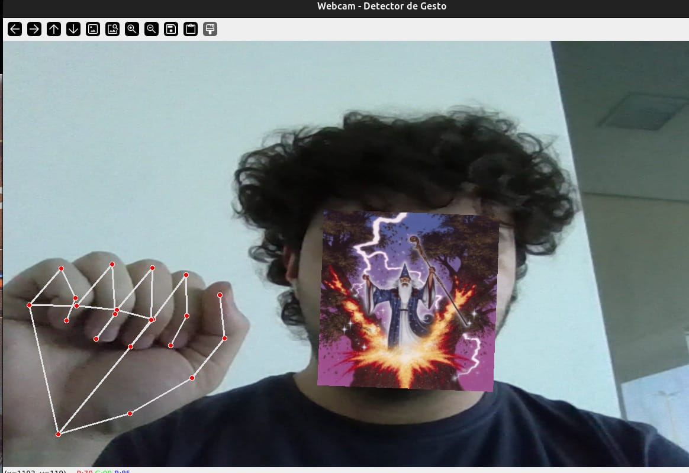
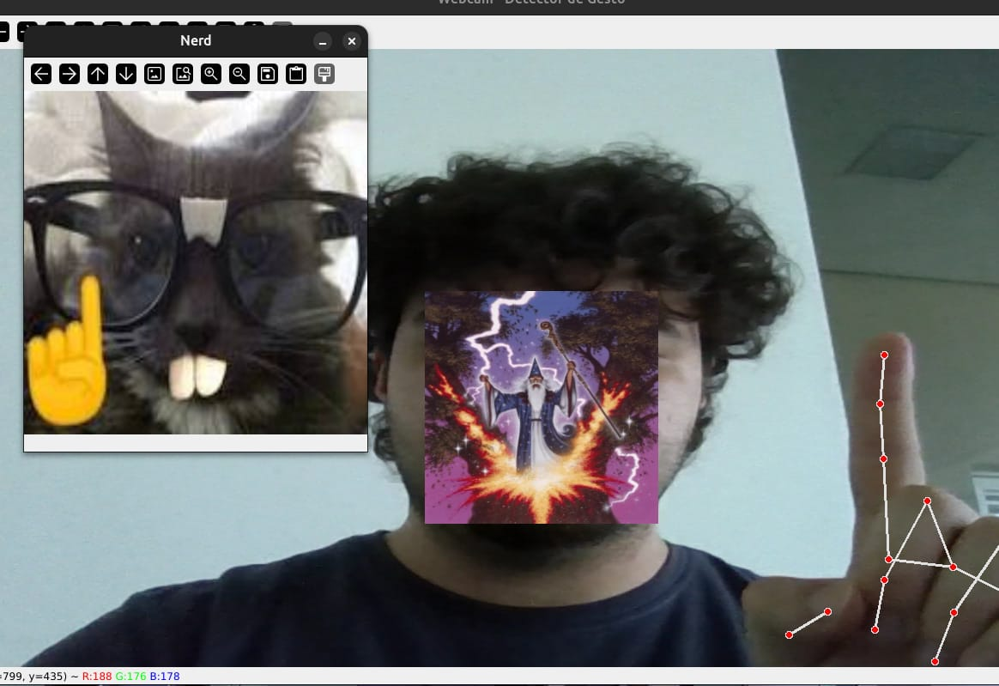

# 🧠😹 Projeto de Visão Computacional Bobin

Um projetinho básico e engraçado de **visão computacional**, feito só pra brincar com o poder do **OpenCV** e da **detecção de movimentos**.

## 🐱 O que ele faz?

Quando você aponta **pra cima** (gesto detectado pela câmera), o programa exibe a imagem de um **gatinho nerd te zoando** 🤓🐾  

É só isso mesmo. Simples, inútil e genial.

## 🧩 Tecnologias usadas

- 🐍 **Python 3.12**
- 👁️ **OpenCV (cv2)** para visão computacional
- 🧠 (Opcional) **NumPy** pra lidar com arrays
- 😼 Uma pitada de humor

## 🖼️ Prints do projeto

Quando o sistema detecta o gesto e o gatinho aparece 👇




## 🚀 Como rodar

Clone o repositório e crie um ambiente virtual:

```bash
git clone https://github.com/pasteldiventu/visao_computacional_basica_bobinha.git
cd visao_computacional_basica_bobinha
python -m venv venv
source venv/bin/activate   # (Linux/Mac)
venv\Scripts\activate      # (Windows)


